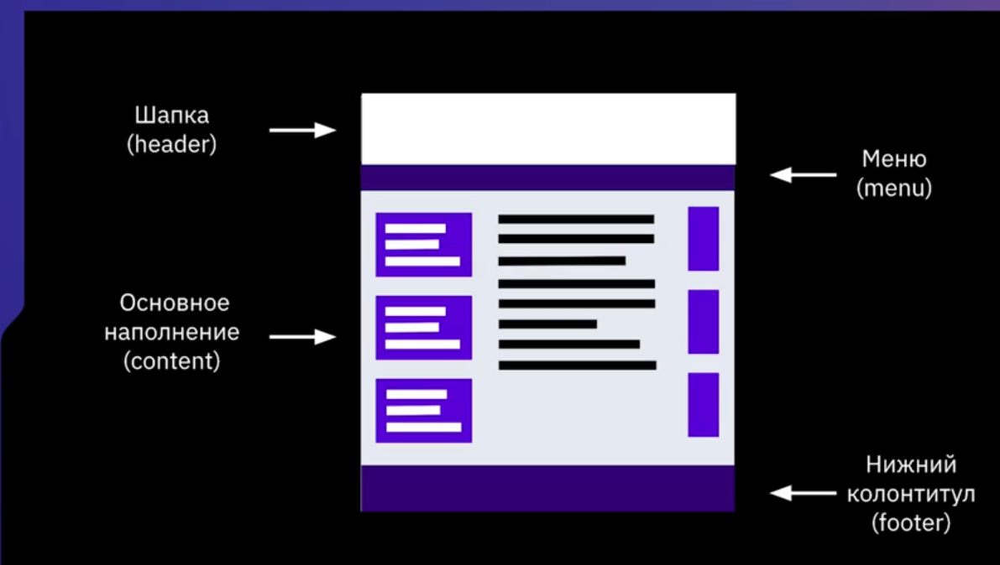
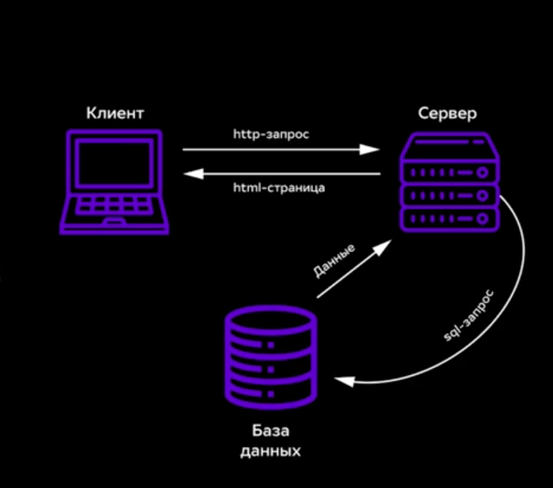
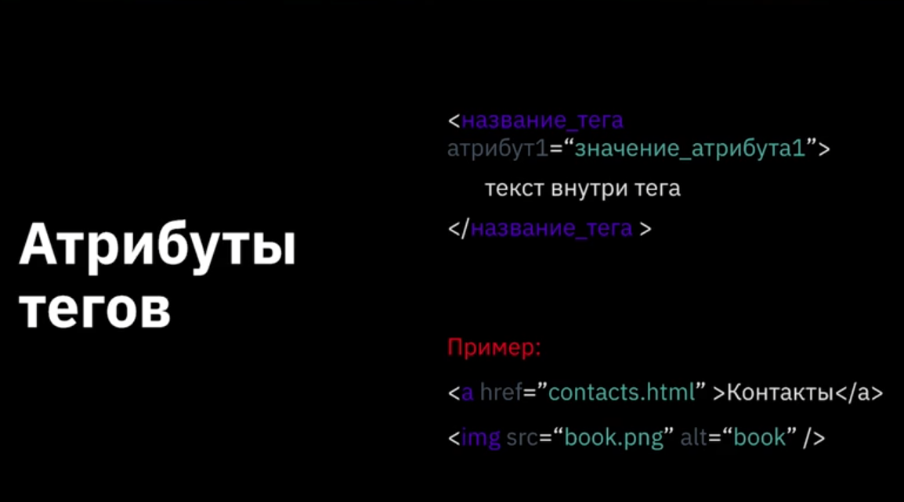

# HTML и CSS
HTML - это контент сайта. HTML - это стандартный язык разметки.
CSS - это каскадные таблицы стилей - формальный язык описания внешнего вида документа, написанного с использованием языка разметка(HTML).

HTML - это данные. CSS - это стиль подачи данных.

# Как работает интернет

Сеть из компьютеров имеющие IP адрес.

# Как устроен сайт?

## Вида сайтов

1. Резиновый - дизайн, в которм ширина столбца/рисунка задана в процентах от текущего разрешения.
2. Фиксированной ширины - сайты с фиксированной шириной. В которых ширина блоков задана точно(в пикселях).
3. Адаптивные - дизайн, который подстраивается под размер экрана, в том числе может происходить перестройка блоков.

## Содержимое сайтов

- Статическое - содержимое подготавливается заранее и выдаётся в том виде, в котором хранится на сервере.
- Динамические - генерируется с помошью серверных языков программирования.

## Протоколы серверов

- HTTP - стандартный протокол передачи данных.
- HTTPS - защищёный протокол передачи данных.
- FTP - протокол обращения к серверу для загрузки большого колличеств данных.

## Схема общения сайта

# HTML

1. Парные теги - два тега один на открытие другой на закрытие

- 
текст внутри тега
 

- <b>текст внутри тега</b> 

- <i>текст внутри тега</i>

2. Одиночные теги - тег в угловых скобках

-   - Перенос строки
- 
 - Горизогтальная черта

3. Атрибуты тега

Никаких заглавных букв!!! 

[Структура html документа](Ex001.html)

4. Типограф - это средство онлайн подготовки текста к веб-изданию.

5. Коментарии пишуться так 
<!-- Коментарий-->

6. Список

- Ненумерованный

<ul>
    <li>1 Элемент</li>
    <li>2 Элемент</li>
    <li>3 Элемент</li>
    <li>4 Элемент</li>
    <li>5 Элемент</li>
    <li>6 Элемент</li>
    <li>7 Элемент</li>
    <li>8 Элемент</li>
</ul>

- Нумерованный

<ol>
    <li>Элемент</li>
    <li>Элемент</li>
    <li>Элемент</li>
    <li>Элемент</li>
    <li>Элемент</li>
    <li>Элемент</li>
    <li>Элемент</li>
    <li>Элемент</li>
</ol>

7. Ссылка

- Относительные ссылки - файлы рядом с друг другом
- Абсолютные ссылки - в сети интернет
- Относительные ссылки - Якорь перемещения по одной странницы

# Формы и их элементы
