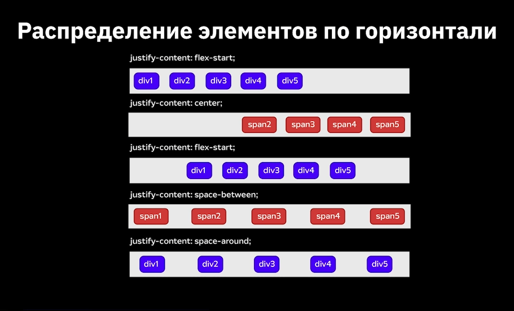
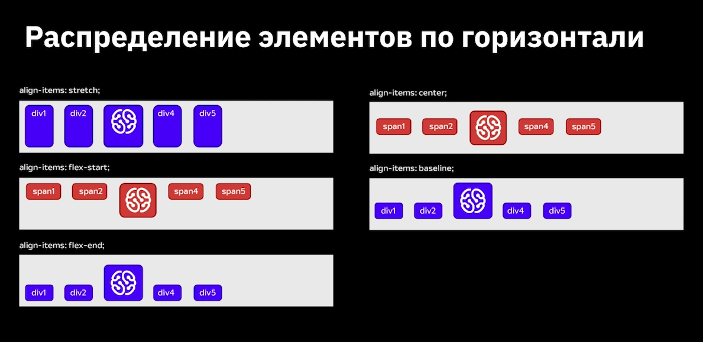

# Свойство display
Значения свойтва display:
1. none - скрытый обьект (который появляеться например при наведении)
2. block - блочный элемент
3. inline - строчный
4. inline-block - строчно-блочный (Элемнет находиться в строке но при этом ему может быть задано значение ширины и высоты)
5. flex - гибкий (Наделение контейнера способностью изменять ширину и высоту для поддержки всех видов дисплеев и разных разрешений экранов.)
6. grid layout - сетка
# FlexBox и Grid layout

[Froggy](https://flexboxfroggy.com/#ru)

[Garden](https://cssgridgarden.com/#ru)

*Нажав .item.item$*6 получим:*

# Позиционирование блоков

Свойство Position обладает значениями:
1. static - нормальное(по умолчанию)
2. relative - относительно
3. absolute - абсолютное
4. fixed - фиксированное
5. inherit - наследует значение родителя

## Шрифты подключаються удобно через google fonts

